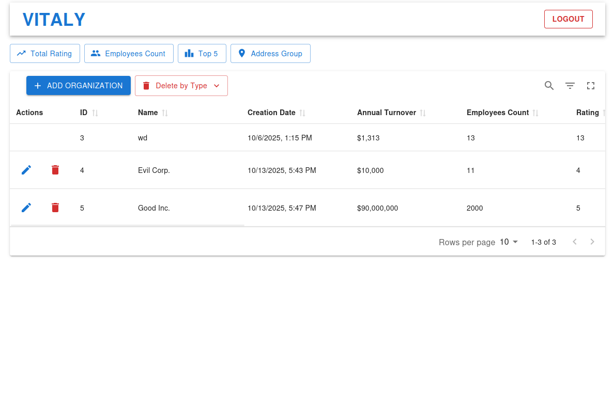
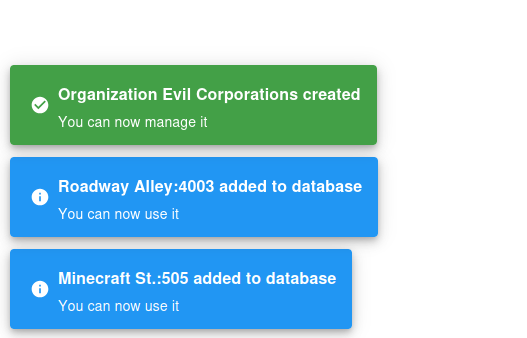

# Organizator WebView

## Table of Contents

- [Overview](#overview)
- [Building and Deployment](#building-and-deployment)
- [Authentication](#authentication)
- [Real-time Features](#real-time-features)
- [Image Gallery](#image-gallery)

## Overview

Webview is a React frontend application for managing organizational data for [Organizator](https://github.com/alldaygooning/organizator) project. It provides a user interface for creating, viewing, editing, and deleting organizations while supporting real-time updates across multiple clients. The application connects to backend microservices for data persistence and authentication.

## Building and Deployment

**Development Mode**: Runs in a [Docker container](https://github.com/alldaygooning/organizator-webview/blob/master/Dockerfile.dev) using Vite development server. The development setup includes hot-reload for efficient development.

**Production Mode**: Builds the application using `npm run build`, which creates optimized production bundles using Vite's build system. Runs in a [Docker container](https://github.com/alldaygooning/organizator/blob/master/nginx/Dockerfile.prod) bundeled together with NGINX.

For comprehensive deployment instructions and environment configuration details, refer to the [📘 Organizator Deployment Guide](https://github.com/alldaygooning/organizator?tab=readme-ov-file#development-mode).

## Authentication

Users can register new accounts or log in with existing credentials. The authentication system validates usernames and passwords client-side before making API requests, however server-side validation of request body is also in-place. Successfully logged-in users are issued Json Web Tokens (JWTs) stored in HTTP Cookie.

Logged-in users can create new organizations and edit or delete organizations they own. The interface adapts based on authentication state, showing appropriate actions and user information in the header.

## Real-time Features

The application maintains a persistent connection to the backend using Server-Sent Events. This allows instant updates across all connected clients when organizations are created, modified, or deleted. The system also receives updates when new addresses or coordinates are added to the database.

The real-time synchronization ensures all users see the same data without needing to refresh the webpage.

## Image Gallery

Notification Snack bar via Notistack

